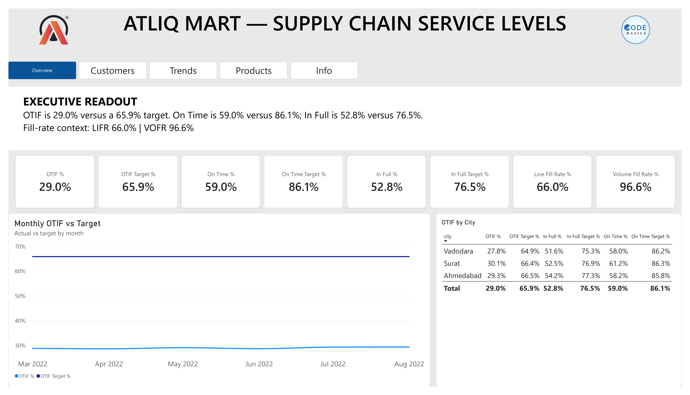

# AtliQ Mart — Supply Chain Service-Level Dashboard

**GitHub Main Project (2nd Portfolio Project)** | **End-to-end supply-chain analytics: 6 CSV tables → Power Query star schema → 19 DAX measures → 5-page Power BI dashboard — with verified numbers and root-cause insights.**

---

## Dashboard Preview



**Full report with all five pages, the complete analysis, and the DAX appendix:**
[AtliQ Mart Supply Chain Service-Level Report (PDF)](report/AtliQ_Mart_Supply_Chain_Report.pdf)

## Business Problem

AtliQ Mart, an FMCG manufacturer in Gujarat (India) serving retail chains across
Surat, Ahmedabad, and Vadodara, is about to expand into new metros and Tier-1
cities. Several key customers have declined to renew their annual supply
contracts, citing late and incomplete deliveries. The overarching question:

> *Where is order fulfillment failing — for whom, how badly, and why — so the
> supply chain can be fixed before the expansion replicates the problem in new
> cities?*

The dashboard tracks the five standard service-level KPIs — **OT%, IF%, OTIF%,
LIFR, VOFR** — for every customer against their negotiated targets, and answers
it through five pages of root-cause views.

## Key Findings

| # | Finding | The numbers |
|---|---------|-------------|
| 1 | **Under half the promised reliability** | OTIF 29.0% vs 65.9% target; **0 of 35 customers** on target; gaps OT −27.1, IF −23.7, OTIF −36.9 pts |
| 2 | **Two independent failure modes** | Mode A — the big-3 chains (Coolblue 13.7%, Acclaimed 15.5%, Lotus 16.3% OTIF; ~30% of all orders) collapse **on-time** (~29%). Mode B — Info Stores, Elite Mart, Sorefoz, Vijay (~23% of orders) ship **on time** (~72%) but **fill** only ~40% |
| 3 | **Systemic, not regional** | City OTIF is 27.8–30.1% — every city fails the same way |
| 4 | **Shortages are small and partial** | LIFR 66.0% but VOFR 96.6% — orders are almost complete, not failed |
| 5 | **Flat but erratic** | Monthly OTIF barely moves (28.7–29.4%) while daily swings reach 22–37% |
| 6 | **Lateness is frequent but shallow** | 28.9% of lines ship late — average 1.7 days, never more than 3 (a scheduling problem, not a transport failure) |

**Recommendations:** run two parallel workstreams — dispatch/scheduling for the
on-time mode and supply planning for the in-full mode; open the renewal
conversation with the big-3 accounts first (they are ~30% of volume); add a
1–2 day scheduling buffer rather than redesigning transport; hold SKU-level
safety stock and review pick accuracy for the small per-line shortfalls; pilot
fixes in Vadodara, the weakest and highest-volume city.

## Dashboard & DAX Measures

The model uses **19 explicit DAX measures** — no implicit aggregations — covering
the five service-level KPIs, per-customer targets, gaps in percentage points,
gap-based conditional colors, and a disconnected `Metrics` table that powers the
metric switcher on the trend charts. A taste of the DAX:

```dax
OTIF % = DIVIDE ( SUM ( fact_orders_aggregate[otif] ), [Total Orders] )

OTIF Gap = ( [OTIF %] - [OTIF Target %] ) * 100

OTIF Gap Color =
VAR GapPoints = [OTIF Gap]
RETURN
    SWITCH ( TRUE (),
        GapPoints >= 0,   "#63BE7B",   -- green  (at/above target)
        GapPoints >= -10, "#FFEB84",   -- yellow (within 10 pts)
        GapPoints >= -25, "#FDAE61",   -- orange (within 25 pts)
        "#F8696B"                      -- red    (beyond 25 pts)
    )

Selected Metric Value =
SWITCH ( SELECTEDVALUE ( Metrics[Metric] ),
    "OT %",   [On Time %],
    "IF %",   [In Full %],
    "OTIF %", [OTIF %],
    "LIFR %", [Line Fill Rate %],
    "VOFR %", [Volume Fill Rate %],
    BLANK ()
)
```

Conditional formatting colors every customer-matrix cell by its gap to target
(green ≥ target, amber within 10 pts, orange within 25, red beyond).

**Verification:** every figure in the dashboard and this README was recomputed
from the raw CSVs during the build (chart data exported and checked by hand).
The headline LIFR 65.96% and VOFR 96.59% reproduce the values widely cited
for this dataset, validating the metric definitions. **Full DAX reference for
all 19 measures:** [`docs/MEASURES.md`](docs/MEASURES.md)

## How this was built

Cleaning (BOM characters, two date formats, capitalization, column renames) →
star-schema model (six single-direction relationships, no fact-to-fact joins)
→ 19 explicit DAX measures → one-page dashboard → five-page restructure (the
original page was split into dedicated pages and retired once every element
was covered elsewhere).
Problems hit and decisions taken are recorded in
[`docs/PROJECT_JOURNAL.md`](docs/PROJECT_JOURNAL.md) — including why the
fact-to-fact `order_id` relationship was deleted and why the targets
relationship is single-direction.

## Pipeline

```
data/ — 6 challenge CSVs (31,729 orders · 57,096 order lines · Mar–Aug 2022)
        │
        ▼  Power Query — cleaning & shaping
   BOM removal · long-format date parsing · category capitalization
   column renames · computed in_full / on_time / on_time_in_full · month_sort
        │
        ▼  Star schema — 6 single-direction relationships
   fact_order_lines · fact_orders_aggregate → dim_customers · dim_products
   · dim_date · dim_targets_orders (no fact-to-fact joins)
        │
        ▼  19 DAX measures
   KPIs · targets · gaps (pts) · conditional colors · metric switcher
        │
        ▼  Power BI Desktop — 5-page dashboard
   KPI cards · city & customer matrices · drillable trend · sparklines
```

## Repository Structure

```
├── README.md
├── LICENSE                          # MIT (this repo)
├── .gitignore
├── data/                            # 6 challenge CSVs (source of truth)
│   ├── dim_customers.csv · dim_date.csv · dim_products.csv · dim_targets_orders.csv
│   └── fact_order_lines.csv · fact_orders_aggregate.csv
├── powerbi/
│   └── AtliQ-Mart-Supply-Chain-Service-Levels-Dashboard.pbix
├── report/
│   └── AtliQ_Mart_Supply_Chain_Report.pdf    # full report with all page screenshots
├── assets/                          # page screenshots (used by the PDF + README preview)
├── docs/
│   ├── ABOUT_THIS_PROJECT.md
│   ├── HOW_TO_NAVIGATE.md
│   ├── MEASURES.md                  # DAX measure reference
│   └── PROJECT_JOURNAL.md           # how it was built — problems & decisions
```

## Tech Stack

| Layer | Tool |
|---|---|
| Cleaning & shaping | Power Query (M) |
| Modeling & measures | Power BI Desktop (star schema + DAX) |
| Documentation | Markdown docs + project journal |

## How to Open

1. Install [Power BI Desktop](https://www.microsoft.com/en-us/power-platform/products/power-bi/desktop)
   (free, Windows).
2. Open `powerbi/AtliQ-Mart-Supply-Chain-Service-Levels-Dashboard.pbix`.
3. Start on **Overview**, then follow `docs/HOW_TO_NAVIGATE.md`.

> The CSV files in `data/` are only needed if you want to rebuild or refresh
> the model — the .pbix already contains the loaded data.

Sanity checks: **OT 59.0% · IF 52.8% · OTIF 29.0% · LIFR 66.0% · VOFR 96.6%** ·
31,729 orders · 57,096 lines · 35 customers · 18 products.

## Credits & Acknowledgements

- **Scenario & data:** Codebasics Resume Project Challenge #2 — AtliQ Mart
  (codebasics.io). Metric definitions follow the challenge brief; the dashboard
  design, analysis, and insights are my own work.

- **First portfolio project:** See [Customer Shopping Trends Analysis](https://github.com/Rishabharya810/Customer-Shopping-Trends-Analysis) — pandas→PostgreSQL ETL + Power BI Desktop dashboard (DAX measures).

## Author

**Rishab Arya** — Data Analyst | M.Tech Data Science candidate
LinkedIn: [linkedin.com/in/rishab-arya-4a84481b1](https://www.linkedin.com/in/rishab-arya-4a84481b1)