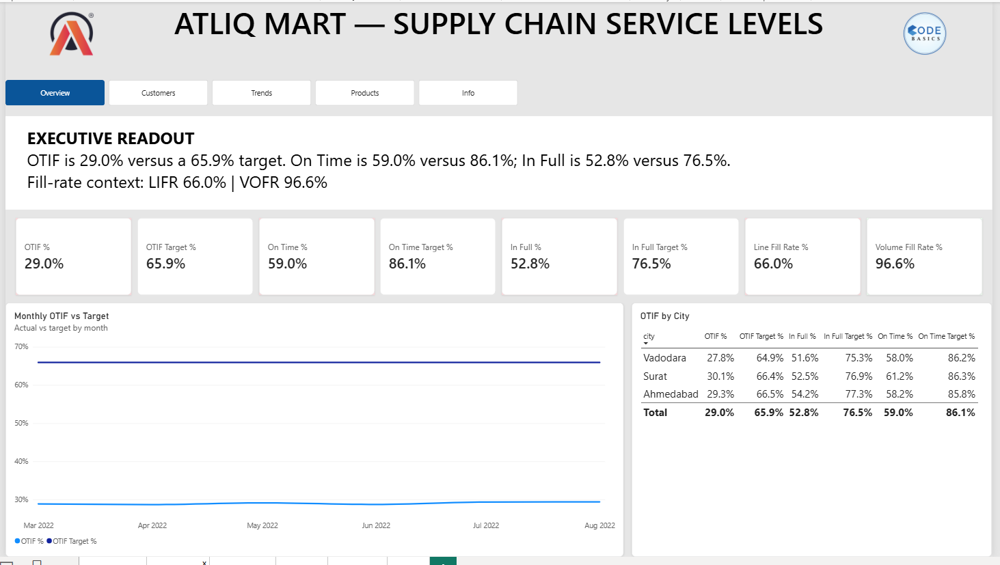

# AtliQ Mart — Supply Chain Service-Level Dashboard

**End-to-end supply-chain analytics: 6 CSV tables → Power Query star schema → 19 DAX measures → 6-page Power BI dashboard — with verified numbers and root-cause insights.**

---

## Live Dashboard

<!-- After publishing to Power BI Service: replace the placeholder below with a screenshot in assets/ and add your Publish-to-web link -->

*Six pages: operational Dashboard, executive Overview, Customers with a watchlist, Trends with month → week → day drill, Products with LIFR/VOFR sparklines, and Definitions & Data Model.*
<!-- Link: [View the interactive dashboard](https://app.powerbi.com/...) -->

## Business Problem

AtliQ Mart, an FMCG manufacturer in Gujarat (India) serving retail chains across
Surat, Ahmedabad, and Vadodara, is about to expand into new metros and Tier-1
cities. Several key customers have declined to renew their annual supply
contracts, citing late and incomplete deliveries. The overarching question:

> *Where is order fulfillment failing — for whom, how badly, and why — so the
> supply chain can be fixed before the expansion replicates the problem in new
> cities?*

The dashboard tracks the five standard service-level KPIs — **OT%, IF%, OTIF%,
LIFR, VOFR** — for every customer against their negotiated targets, and answers
it through six pages of root-cause views.

## Key Findings

| # | Finding | The numbers |
|---|---------|-------------|
| 1 | **Under half the promised reliability** | OTIF 29.0% vs 65.9% target; **0 of 35 customers** on target; gaps OT −27.1, IF −23.7, OTIF −36.9 pts |
| 2 | **Two independent failure modes** | Mode A — the big-3 chains (Coolblue 13.7%, Acclaimed 15.5%, Lotus 16.3% OTIF; ~30% of all orders) collapse **on-time** (~29%). Mode B — Info Stores, Elite Mart, Sorefoz, Vijay (~23% of orders) ship **on time** (~72%) but **fill** only ~40% |
| 3 | **Systemic, not regional** | City OTIF is 27.8–30.1% — every city fails the same way |
| 4 | **Shortages are small and partial** | LIFR 66.0% but VOFR 96.6% — orders are almost complete, not failed |
| 5 | **Flat but erratic** | Monthly OTIF barely moves (28.7–29.4%) while daily swings reach 22–37% |
| 6 | **Lateness is frequent but shallow** | 28.9% of lines ship late — average 1.7 days, never more than 3 (a scheduling problem, not a transport failure) |

**Recommendations:** run two parallel workstreams — dispatch/scheduling for the
on-time mode and supply planning for the in-full mode; open the renewal
conversation with the big-3 accounts first (they are ~30% of volume); add a
1–2 day scheduling buffer rather than redesigning transport; hold SKU-level
safety stock and review pick accuracy for the small per-line shortfalls; pilot
fixes in Vadodara, the weakest and highest-volume city.

## Dashboard & DAX Measures

The model uses explicit DAX measures throughout — no implicit aggregations —
including the five service-level KPIs, per-customer targets, gap measures in
percentage points, and a disconnected `Metrics` table that powers a metric
switcher on the trend charts. Conditional formatting colors every customer
matrix cell by its gap to target (green ≥ target, amber within 10 pts, orange
within 25, red beyond).

**Verification:** every figure in the dashboard and this README was recomputed
from the raw CSVs with `scripts/analysis.py` (pandas). The headline LIFR 65.96%
and VOFR 96.59% reproduce the values widely cited for this dataset, validating
the metric definitions. Full measure reference:
[`docs/MEASURES.md`](docs/MEASURES.md)

## Pipeline

```
data/ — 6 challenge CSVs (31,729 orders · 57,096 order lines · Mar–Aug 2022)
        │
        ▼  Power Query — cleaning & shaping
   BOM removal · long-format date parsing · category capitalization
   column renames · computed in_full / on_time / on_time_in_full · month_sort
        │
        ▼  Star schema — 6 single-direction relationships
   fact_order_lines · fact_orders_aggregate → dim_customers · dim_products
   · dim_date · dim_targets_orders (no fact-to-fact joins)
        │
        ▼  19 DAX measures
   KPIs · targets · gaps (pts) · conditional colors · metric switcher
        │
        ▼  Power BI Desktop — 6-page dashboard
   KPI cards · city & customer matrices · drillable trend · sparklines
        │
        ▼  Independent verification (pandas)
   scripts/analysis.py · scripts/verify_data.py (official checksums)
```

## Repository Structure

```
├── README.md
├── LICENSE                          # MIT (this repo)
├── requirements.txt
├── .gitignore
├── data/                            # 6 challenge CSVs (source of truth)
│   ├── dim_customers.csv · dim_date.csv · dim_products.csv · dim_targets_orders.csv
│   └── fact_order_lines.csv · fact_orders_aggregate.csv
├── powerbi/
│   └── AtliQ-Mart-Supply-Chain-Service-Levels-Dashboard.pbix
├── scripts/
│   ├── analysis.py                  # reproduces every KPI & chart (pandas)
│   └── verify_data.py               # checks data/ against the official dataset
├── assets/                          # page screenshots
├── docs/
│   ├── ABOUT_THIS_PROJECT.md
│   ├── HOW_TO_NAVIGATE.md
│   └── MEASURES.md                  # DAX measure reference
```

## Tech Stack

| Layer | Tool |
|---|---|
| Cleaning & shaping | Power Query (M) |
| Modeling & measures | Power BI Desktop (star schema + DAX) |
| Verification | Python (pandas, numpy, matplotlib, seaborn) |
| Documentation | Markdown docs + DAX measure reference |

## How to Reproduce

1. **Clone the repo** and install dependencies: `pip install -r requirements.txt`
2. **Verify the data:** `python scripts/verify_data.py` (compares every CSV to
   the official Codebasics challenge checksums; exit 0 = identical)
3. **Regenerate the numbers:** `python scripts/analysis.py` — writes KPI
   summaries, breakdowns, and charts into `scripts/`
4. **Open the dashboard:** `powerbi/AtliQ-Mart-Supply-Chain-Service-Levels-Dashboard.pbix`
   in Power BI Desktop (the data is already loaded; the CSVs are only needed to
   rebuild or refresh the model)

Sanity checks: **OT 59.0% · IF 52.8% · OTIF 29.0% · LIFR 66.0% · VOFR 96.6%** ·
31,729 orders · 57,096 lines · 35 customers · 18 products.

## Credits & Acknowledgements

- **Scenario & data:** Codebasics Resume Project Challenge #2 — AtliQ Mart
  (codebasics.io). Metric definitions follow the challenge brief; the dashboard
  design, analysis, and insights are my own work.

## Author

**Rishab Arya** — Data Analyst | M.Tech Data Science candidate
LinkedIn: [linkedin.com/in/rishab-arya-4a84481b1](https://www.linkedin.com/in/rishab-arya-4a84481b1)