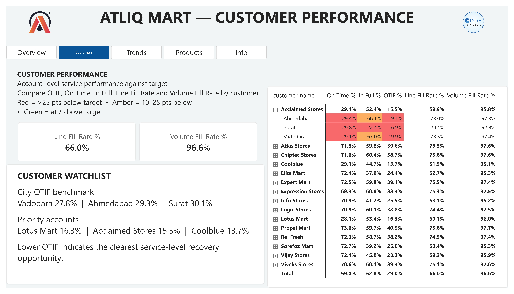
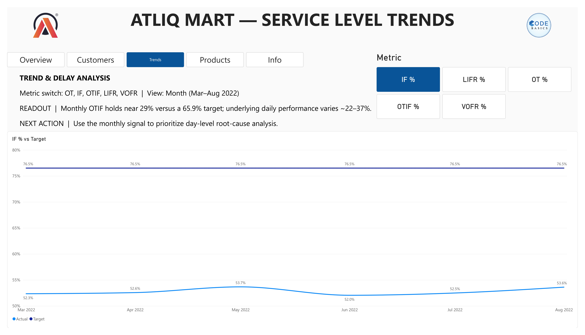
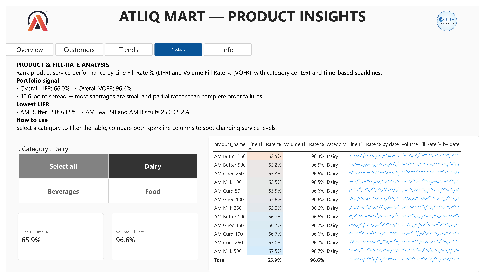
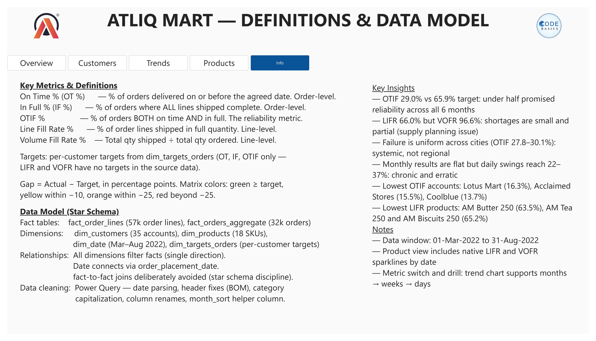

# How to Navigate the Dashboard

## Overview

The five service-level KPIs against targets, the city split, and the monthly
OTIF trend. Start here for the one-screen answer to "how are we doing?"

## Customers

Account-level matrix with On Time %, In Full %, OTIF %, Line Fill Rate % and
Volume Fill Rate % per customer. The colors follow the target gap:

- 🟩 Green — at or above target
- 🟨 Amber — within 10–25 points below target
- 🟥 Red — more than 25 points below target

The **Customer Watchlist** panel lists the city OTIF benchmark and the priority
accounts (chain-level OTIF).

## Trends

Monthly OTIF vs target with the metric switcher; drill months → weeks → days to
see how stable the daily performance really is.

## Products

LIFR and VOFR by product, with **sparklines** showing each metric over time.
Use the **category slicer** (Dairy / Food / Beverages) to filter the table.

## Definitions & Data Model

Metric definitions, the star-schema layout (fact and dimension tables, all
relationships single-direction), data-cleaning notes, and the key insights.

